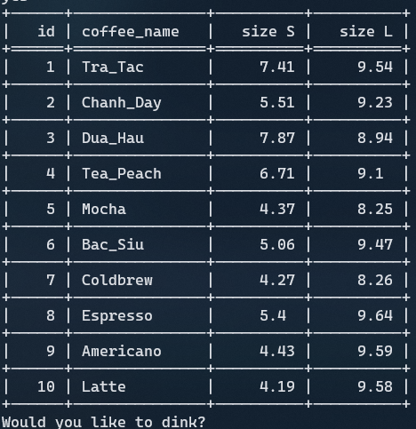
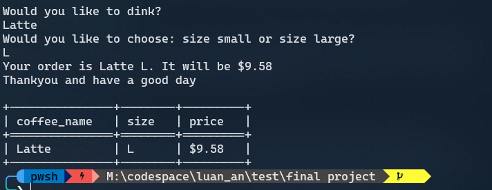

# KHOI NGUYEN'S COFFEE HOUSE - CS50P Final Project

### Video Demo : https://www.youtube.com/watch?v=PGsBpj9mK2Q

## Description

This is my final project for CS50’s Introduction to Programming with Python course. A simple program, takes coffee orders from customers, then returns the receipt include coffee name, the price that customers need to pay and size

This program will print out the menu when the customers need to order. The menu is stored at menu.csv, you can easily get it from mockaroo



You can type input is 1 2 3 or the name like Mocha,Latte, and choose the size for it. It will print out the price that the customers need to pay. The customers's order will stored at order.csv.


### Github name: nguyn21012003

### edX name: Nguyenkool21-1

### Python libraries

1. Tabulate.

   ```terminal
   pip install tabulate
   ```

2. Pyfiglet.

   ```terminal
    pip install pyfiglet
   ```

## File structure

```text
📦 FINAL PROJECT
    ├─ coffee.py
    ├─ test_coffee.py
    ├─ menu.csv
    ├─ order.csv
    └─ README.md
```

The coffee.py is a main file. It include 2 features. Firstly, it will print the menu item which stored at menu.csv. Secondly, that will take the order from customers and print the bill

The order from customers will be stored at order.csv.

This concept took idea from the vending machine. It will take one order from customer and print out 1 output. Very simple to do. You can do it by yourself.

## About CS50

CS50 is a openware course from Havard University and taught by David J. Malan

Introduction to the intellectual enterprises of computer science and the art of programming. This course teaches students how to think algorithmically and solve problems efficiently. Topics include abstraction, algorithms, data structures, encapsulation, resource management, security, and software engineering. Languages include C, Python, and SQL plus students’ choice of: HTML, CSS, and JavaScript (for web development).

Thank you for all CS50.

- Where I get CS50 course? https://cs50.harvard.edu/x/2020/

## About the author

My name is Tran Khoi Nguyen, but you can call me Jeremy. My name is inspired by the character Jeremy from the Phineas and Ferb cartoon. Im a senior physics student based in Ho Chi Minh city with a passion not only for learning theoretical physics but also building stuff he wants.

You can visit [my page](<h[ttps://](https://jeremy-tran.vercel.app/about)>) for know more
